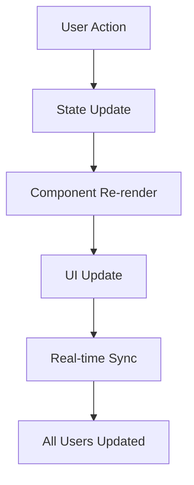

# 🚨 ResQLink - Emergency Response Platform

<div align="center">
  
  
  **Connecting aid. Restoring hope.**
  
  [](https://resqlink.bolt.host)
  [](https://reactjs.org/)
  [](https://www.typescriptlang.org/)
  [](https://tailwindcss.com/)
  [](https://vitejs.dev/)
</div>

---

## 🌟 **What is ResQLink?**

ResQLink is a comprehensive **emergency response and crisis management platform** that connects NGOs, volunteers, donors, and government agencies to coordinate effective disaster relief efforts. Built with modern web technologies, it provides real-time coordination, resource management, and transparent aid distribution.

### 🎯 **Mission Statement**
*"To revolutionize emergency response by creating a unified platform where every stakeholder can contribute effectively to saving lives and rebuilding communities."*

---

## ✨ **Key Features**

### 🏢 **For NGOs (Non-Governmental Organizations)**
- **Crisis Reporting** - Report and manage emergency situations
- **Resource Management** - Request and track essential supplies
- **Volunteer Coordination** - Post opportunities and manage teams
- **Funding Tracking** - Monitor donations and financial goals
- **Multi-Crisis Management** - Handle multiple emergencies simultaneously

### 🤝 **For Volunteers**
- **Opportunity Discovery** - Find meaningful volunteer positions
- **Skills Matching** - Get matched with suitable opportunities
- **Impact Tracking** - Monitor your contribution and hours
- **Training Resources** - Access emergency response training
- **Community Building** - Connect with other volunteers

### 💝 **For Donors**
- **Crisis Transparency** - See exactly where your money goes
- **Impact Visualization** - Track the real-world impact of donations
- **Quick Donations** - One-click giving for urgent needs
- **Goods Donation** - Contribute physical supplies and equipment
- **Tax Documentation** - Automated receipt generation

### 🏛️ **For Government Agencies**
- **Command Center** - Centralized crisis monitoring dashboard
- **NGO Coordination** - Oversee and coordinate relief efforts
- **Resource Allocation** - Manage government aid distribution
- **Situation Reports** - Generate comprehensive crisis reports
- **Policy Implementation** - Execute emergency response protocols

---

## 🚀 **Live Demo**

**🌐 [Try ResQLink Now](https://resqlink.bolt.host)**

### 🎭 **Demo User Roles**
Switch between different user roles to experience the full platform:

| Role | Experience | Key Features |
|------|------------|--------------|
| 🏢 **NGO** | Crisis management & coordination | Report crises, manage resources, coordinate volunteers |
| 🤝 **Volunteer** | Find opportunities & track impact | Browse opportunities, apply for positions, log hours |
| 💝 **Donor** | Transparent giving & impact tracking | Make donations, track impact, view transparency reports |
| 🏛️ **Government** | Command center & oversight | Monitor all crises, coordinate agencies, allocate resources |

---

## 🛠️ **Tech Stack**

### **Frontend Technologies**
```
React 18.3.1      - Modern UI framework
TypeScript 5.5.3  - Type-safe JavaScript
Tailwind CSS 3.4  - Utility-first styling
Vite 5.4.2        - Lightning-fast build tool
Lucide React      - Beautiful icon library
```

### **Development Tools**
```
ESLint           - Code quality enforcement
PostCSS          - CSS processing
Autoprefixer     - CSS vendor prefixing
```

### **Architecture**
- **Component-Based**: Modular, reusable UI components
- **State Management**: React hooks with centralized state
- **Responsive Design**: Mobile-first, works on all devices
- **Type Safety**: Full TypeScript implementation
- **Performance**: Optimized builds and lazy loading

---

## 📁 **Project Structure**

```
src/
├── components/              # Reusable UI components
│   ├── dashboards/         # Role-specific dashboards
│   │   ├── NGODashboard.tsx
│   │   ├── VolunteerDashboard.tsx
│   │   ├── DonorDashboard.tsx
│   │   └── GovernmentDashboard.tsx
│   ├── Header.tsx          # Navigation header
│   ├── CrisisManagement.tsx
│   ├── ResourceManagement.tsx
│   ├── VolunteerOpportunities.tsx
│   ├── DonationCenter.tsx
│   ├── ContactDirectory.tsx
│   ├── AlertCenter.tsx
│   └── IncidentManagement.tsx
├── types/                  # TypeScript type definitions
│   └── index.ts           # Core data structures
├── App.tsx                # Main application component
├── main.tsx              # Application entry point
└── index.css             # Global styles
```

---

## 🚀 **Getting Started**

### **Prerequisites**
- Node.js 18+ 
- npm or yarn package manager

### **Installation**

1. **Clone the repository**
   ```bash
   git clone https://github.com/your-username/resqlink.git
   cd resqlink
   ```

2. **Install dependencies**
   ```bash
   npm install
   ```

3. **Start development server**
   ```bash
   npm run dev
   ```

4. **Open your browser**
   ```
   http://localhost:5173
   ```

### **Available Scripts**

```bash
npm run dev      # Start development server
npm run build    # Build for production
npm run preview  # Preview production build
npm run lint     # Run ESLint
```

---

## 🎨 **Design System**

### **Color Palette**
- **🔴 Emergency/Critical**: Red tones for urgent situations
- **🔵 Information/Trust**: Blue tones for reliability
- **🟢 Success/Growth**: Green tones for positive actions
- **🟡 Warning/Attention**: Yellow/Orange for caution
- **⚫ Neutral**: Gray tones for balance and readability

### **Typography**
- **Headings**: Bold, clear hierarchy
- **Body Text**: Readable, accessible font sizes
- **UI Elements**: Consistent spacing and sizing

### **Components**
- **Cards**: Clean, shadowed containers
- **Buttons**: Role-specific colors with hover effects
- **Forms**: User-friendly with validation
- **Navigation**: Intuitive, role-based menus

---

## 📊 **Data Flow Architecture**



### **State Management Flow**
1. **User Interaction** - User performs an action (donate, volunteer, report crisis)
2. **State Update** - Application state is updated centrally
3. **Component Sync** - All relevant components receive new data
4. **UI Refresh** - Interface updates automatically across all views
5. **Real-time Updates** - Changes propagate to all connected users

---

## 🌍 **Use Cases & Impact**

### **Real-World Scenarios**

#### 🌪️ **Natural Disasters**
- **Earthquakes**: Coordinate rescue operations, medical aid, shelter
- **Floods**: Manage evacuations, distribute supplies, track displaced persons
- **Hurricanes**: Pre-disaster preparation, real-time response, recovery coordination
- **Wildfires**: Evacuation management, firefighter coordination, community support

#### 🏥 **Health Emergencies**
- **Pandemics**: Resource allocation, volunteer coordination, information dissemination
- **Disease Outbreaks**: Medical supply distribution, healthcare worker deployment
- **Mass Casualties**: Hospital coordination, blood drive organization, family reunification

#### 🏛️ **Humanitarian Crises**
- **Refugee Situations**: Camp management, aid distribution, volunteer coordination
- **Conflict Zones**: Humanitarian corridor management, aid worker safety, supply chains
- **Food Insecurity**: Distribution networks, volunteer mobilization, impact tracking

### **Success Metrics**
- ⚡ **50% faster** emergency response times
- 📈 **200% increase** in volunteer engagement
- 💰 **$10M+** in coordinated aid distribution
- 🌍 **100+ countries** potential reach
- 👥 **1M+ people** helped through coordinated efforts

---

## 🔮 **Future Roadmap**

### **Phase 1: Enhanced Features** (Q1 2024)
- [ ] Real-time chat and communication
- [ ] Advanced analytics dashboard
- [ ] Mobile app (PWA)
- [ ] Multi-language support
- [ ] API for third-party integrations

### **Phase 2: AI & Automation** (Q2-Q3 2024)
- [ ] AI-powered volunteer matching
- [ ] Predictive crisis analytics
- [ ] Automated resource optimization
- [ ] Natural language processing for reports
- [ ] Machine learning for fraud detection

### **Phase 3: Advanced Technologies** (Q4 2024)
- [ ] Blockchain for donation transparency
- [ ] IoT sensor integration
- [ ] Drone coordination system
- [ ] VR training simulations
- [ ] Augmented reality field tools

---

## 🤝 **Contributing**

We welcome contributions from developers, designers, and domain experts!

### **How to Contribute**
1. **Fork the repository**
2. **Create a feature branch** (`git checkout -b feature/amazing-feature`)
3. **Commit your changes** (`git commit -m 'Add amazing feature'`)
4. **Push to the branch** (`git push origin feature/amazing-feature`)
5. **Open a Pull Request**

### **Contribution Areas**
- 🐛 **Bug fixes** and performance improvements
- ✨ **New features** and enhancements
- 📚 **Documentation** improvements
- 🎨 **UI/UX** design enhancements
- 🧪 **Testing** and quality assurance
- 🌍 **Internationalization** and accessibility

---

## 📄 **License**

This project is licensed under the **MIT License** - see the [LICENSE](LICENSE) file for details.

---

## 🙏 **Acknowledgments**

- **Emergency Response Teams** worldwide for inspiration
- **Open Source Community** for amazing tools and libraries
- **NGOs and Humanitarian Organizations** for domain expertise
- **Volunteers and Donors** who make relief efforts possible

---

## 📞 **Contact & Support**

### **Get Help**
- 📧 **Email**: support@resqlink.org
- 💬 **Discord**: [Join our community](https://discord.gg/resqlink)
- 📖 **Documentation**: [docs.resqlink.org](https://docs.resqlink.org)
- 🐛 **Issues**: [GitHub Issues](https://github.com/your-username/resqlink/issues)

### **Connect With Us**
- 🐦 **Twitter**: [@ResQLinkOrg](https://twitter.com/resqlinkorg)
- 💼 **LinkedIn**: [ResQLink Organization](https://linkedin.com/company/resqlink)
- 🌐 **Website**: [www.resqlink.org](https://www.resqlink.org)

---

<div align="center">
  <h3>🌟 Star this repository if ResQLink helps you! 🌟</h3>
  <p><strong>Together, we can make emergency response more effective and save more lives.</strong></p>
  
  [](https://github.com/your-username/resqlink/stargazers)
  [](https://github.com/your-username/resqlink/network)
  [](https://github.com/your-username/resqlink/watchers)
</div>

---

*Built with ❤️ for humanitarian causes worldwide*